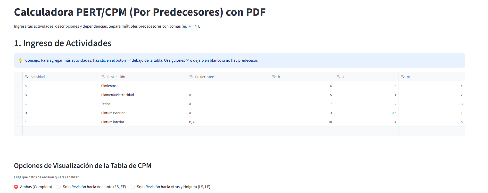
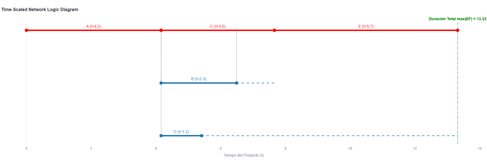

# Generador PERT/CPM: Time-Scaled Network Logic Diagram

Este proyecto es una aplicación web interactiva desarrollada en **Python** y **Streamlit** que resuelve modelos de redes de actividades (PERT/CPM) y renderiza automáticamente un **Diagrama a Escala de Tiempo (Time-Scaled Network Logic)**. 

A diferencia de los diagramas de red topológicos tradicionales (AON/AOA), este motor gráfico proyecta las tareas en un plano cartesiano estricto, donde el eje X representa el tiempo métrico real y las dependencias se trazan mediante geometría ortogonal.


-----------------------------------------------------------------------------------------------------------------------------------------------------------------------

## Vista Previa


-----------------------------------------------------------------------------------------------------------------------------------------------------------------------




-----------------------------------------------------------------------------------------------------------------------------------------------------------------------

## Características Principales

* **Interfaz Dinámica:** Ingreso de datos tabular para definir Actividades, Duración y Precedencias (múltiples dependencias soportadas).
* **Motor Matemático (CPM):** Algoritmo de Teoría de Grafos que valida la ausencia de ciclos (DAG) y ejecuta el pase hacia adelante (ES, EF) y hacia atrás (LS, LF) para encontrar la Ruta Crítica y las holguras.
* **Algoritmo de Carriles (Lane Assignment):** Empaquetamiento espacial que previene colisiones visuales entre tareas que ocurren en paralelo.
* **Renderizado Cartesiano Avanzado:** Trazado geométrico donde las tareas miden exactamente su duración temporal y las conexiones son líneas 100% verticales u horizontales.


##  Arquitectura del Programa

El flujo de trabajo se divide en cuatro fases lógicas:

1. **Entrada y Estructuración (Frontend):** Se capturan los datos mediante `streamlit` y se estructuran en un `DataFrame` de Pandas para su limpieza y procesamiento.
2. **Cálculo de la Red (NetworkX):** Se construye un Grafo Dirigido Acíclico (DAG). El programa calcula los tiempos de inicio y fin (tempranos y tardíos) y determina qué tareas conforman la ruta crítica (holgura = 0).
3. **Distribución Espacial (Eje Y):** Se implementa un algoritmo iterativo que asigna una coordenada Y (carril) a cada tarea ordenadas por su tiempo de inicio, "empujando" hacia abajo las tareas simultáneas para evitar traslapes.
4. **Visualización Cartesiana (Plotly):** Se dibujan las tareas como segmentos de línea de longitud exacta, las dependencias como trayectorias ortogonales de tres puntos y la holgura disponible como líneas punteadas, generando un diagrama visualmente impecable.

-----------------------------------------------------------------------------------------------------------------------------------------------------------------------

## Vista streamlit.app

https://metodorutacriticacpm-a7245ywxa4utpqvarsmtjy.streamlit.app/


## Instalación y Uso

Para ejecutar este proyecto en tu entorno local, asegúrate de tener **Python 3.8+** instalado y sigue estos pasos:

1. **Clona el repositorio:**
   ```bash
   git clone [https://github.com/emilianoruiz23/MetodoRutaCriticaCPM.git](https://github.com/emilianoruiz23/MetodoRutaCriticaCPM.git)
   ## cd Time-Scaled-Network-Logic 
   ##&
   ## cd app.py 

## 📌 Créditos

Este proyecto fue desarrollado de manera colaborativa por:
- Emiliano Ruiz  
- Ricardo Lopez  
Como parte del estudio y aplicación de métodos de optimización y redes (CPM).
